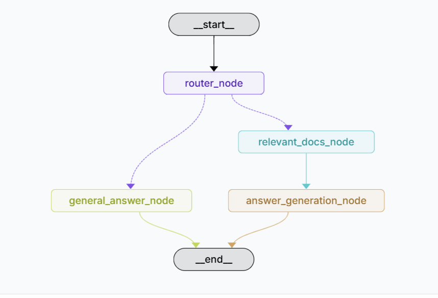

## Adaptive+Advanced-RAG based Chatbot

### Overview

This project implements Adaptive + Advanced RAG (Retrieval-Augmented Generation) system using LangGraph and Langchain pre built components for intelligent document retrieval and query processing. The system combines adaptive query routing with advanced document processing techniques to deliver contextual, accurate responses while maintaining conversation continuity.

The system intelligently routes queries between general knowledge responses and document-based retrieval, optimizing both response quality and processing efficiency through advanced RAG techniques.

### Architecture

<p align="center">
  
</p>

The system uses a multi-node workflow architecture powered by LangGraph with the following key components:

Router Node: Intelligent LLM-based query classification that determines whether queries require document retrieval or can be answered with general knowledge

General Answer Node: Handles conceptual and general knowledge queries using direct LLM responses

Document Retrieval Node: Implements advanced document processing with multi-query retrieval, compression, and reranking

Answer Generation Node: Generates contextual responses using retrieved documents with proper citation and formatting

### Workflow Process:

User query enters the router node

LLM performs intelligent classification (general vs retrieval-based)

Query routes to appropriate processing path

Advanced document processing (if retrieval path selected)

Generate contextual response with proper formatting

Maintain conversation memory across interactions

### Key Features
### Advanced RAG Components

Multi-Query Retriever: Generates multiple query variations for comprehensive document retrieval

FlashrankRerank: State-of-the-art document reranking for relevance optimization

Contextual Compression: Intelligent document compression while preserving key information

Redundancy Filtering: Removes duplicate or highly similar documents using embeddings similarity

Document Pipeline: Chains multiple compression and filtering techniques

### Adaptive Capabilities

Intelligent Query Routing: LLM-based classification with structured output

Dynamic Workflow Selection: Automatic routing between retrieval and knowledge-based responses

Context-Aware Processing: Maintains conversation history and adapts responses accordingly

Memory Management: Persistent conversation state with thread-based memory

### Technical Stack

LangGraph: Workflow orchestration and state management

LangChain: RAG components and retrieval systems

Groq: High-performance LLM provider (ChatGroq)

HuggingFace: Embeddings model for semantic search

Chroma: Vector database for document storage and similarity search

Python 3.11+: Core programming language

## Getting Started

### Prerequisites

* Requires Python version **3.11** or higher.

### Installing

* Clone the repository:
```
git clone https://github.com/Mittali-b/Mohawk-AgenticAI-Backend.git
```
* Navigate to the root directory and create virtual environment, activate it and install Poetry:
```
virtualenv venv
venv/scripts/activate
pip install poetry
```
* Initialize and Install the Poetry dependencies:
```
poetry init
poetry install --no-root 

```
* Create a .env file in the root directory and add the environment variables:
```
GROQ_MODEL=
GROQ_API_KEY=
EMBEDDINGs_MODEL = 
PERSIST_DIRECTORY = 
LANGSMITH_API_KEY=your_langsmith_api_key
LANGSMITH_TRACING=your_langsmith_tracing
LANGSMITH_ENDPOINT=your_langsmith_endpoint
LANGSMITH_PROJECT=your_langsmith_project
```

### Running

* Run the LangGraph Studio using:
```
langgraph dev
```
